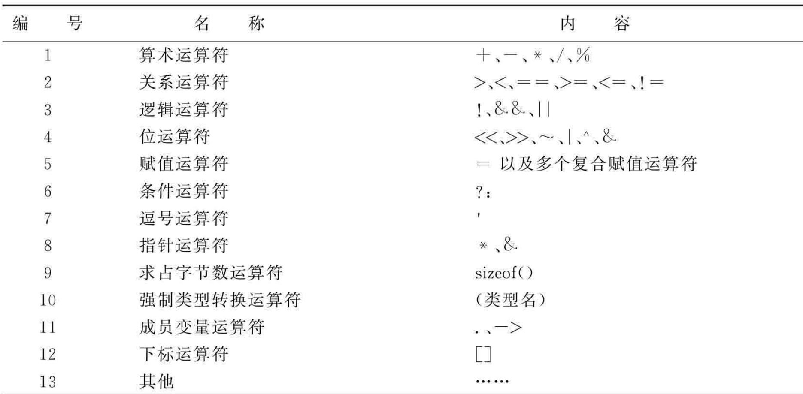
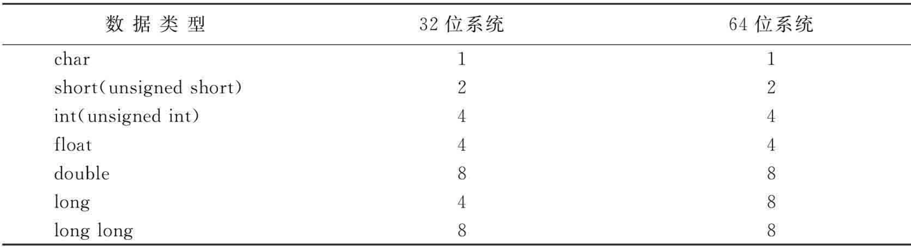

# 第2章 数据类型、运算符与表达式

## 1 数据类型
### 1.1 基本类型
1) 短整型：short  
2) 整型：int
3) 长整型：long
4) 单精度浮点：float
5) 双精度浮点：double
6) 字符：char

### 1.2 构造类型
1) 数组：array
2) 结构体：struct
3) 共用体：union
4) 枚举：enum

### 1.3 指针类型
### 1.4 空类型
1) 空类型：void

## 2 运算符


## 3 常用类型占用存储

1) 通过sizeof运算符可以获取变量占用的内存大小
2) 在C语言中，32位系统，指针占用4个字节，64位系统，指针占用8个字节

## 4 整型数据
1) 八进制以0开头的数字
2) 十六进制以0x开头的数字

## 5 浮点数据


## 6 字符数据
1) 定义一个字符
```c
char a = 'a'; 
```
字符占用一个字节的存储  
定义字符使用单引号
字符的取值范围为：-128~127  
如果定义的字符超过了此范围将发生截断
```c
int main()
{
    int a = 1;
    char c = 9000;
    printf("%d", c);
}
```
如上代码，因为9000超过了char的取值范围  
先将9000转换成二进制：10001100101000  
取低8位：00101000  
则输出的值为：40


2) 定义一个字符串
```c
char a[] = "hello"; 
```
字符串占用的存储 = 字符串的长度 + 1，因为字符串必须以 `\0`结尾，该字符也占用一个字节  
定义字符串使用双引号


## 7 赋值运算符和逗号运算符
1) 赋值运算符


2) 逗号运算符

